# 国际化平台流程图

## 1. 整体系统架构流程

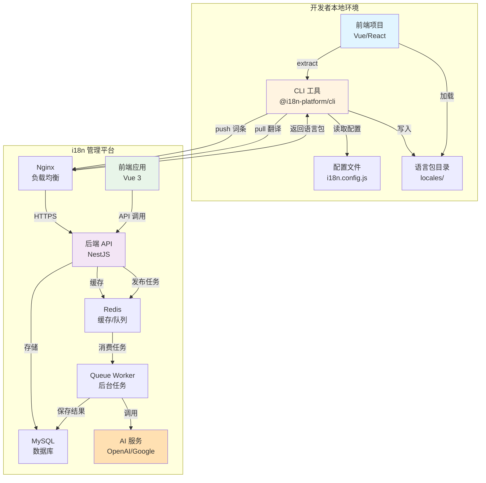

## 2. CLI 工作流程

### 2.1 初始化流程

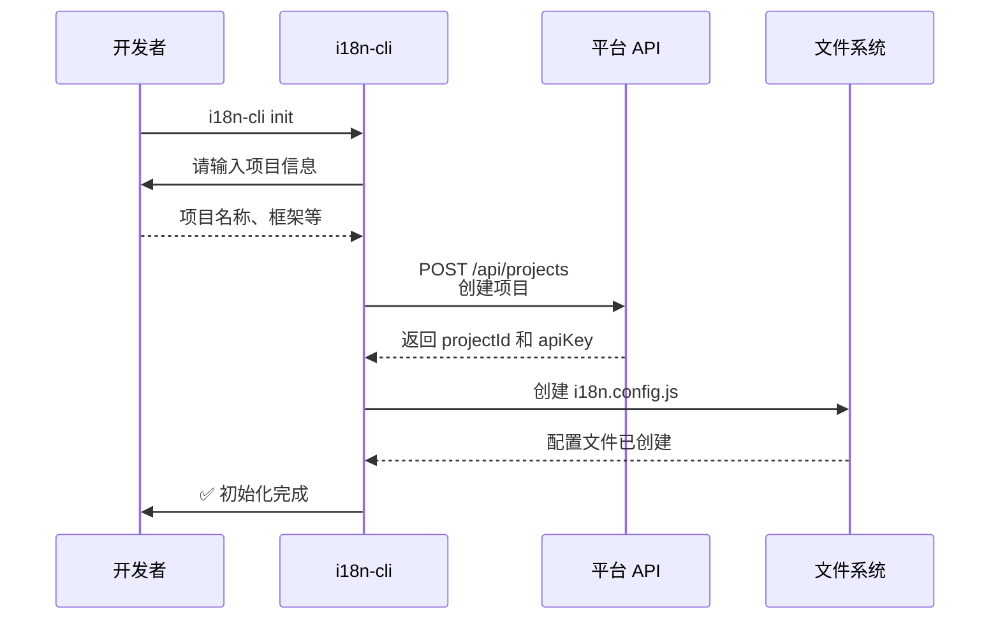

### 2.2 提取词条流程

```mermaid
flowchart TD
    Start([i18n-cli extract]) --> LoadConfig[加载配置文件]
    LoadConfig --> ScanFiles[扫描源代码文件<br/>根据 include/exclude]
    
    ScanFiles --> CheckFramework{检查框架类型}
    CheckFramework -->|Vue| VueParser[Vue 解析器]
    CheckFramework -->|React| ReactParser[React 解析器]
    
    VueParser --> ParseTemplate[解析 Template<br/>查找 $t 调用]
    VueParser --> ParseScript[解析 Script<br/>AST 遍历]
    
    ReactParser --> ParseJSX[解析 JSX<br/>查找 t() 和 Trans]
    
    ParseTemplate --> Collect[收集所有词条]
    ParseScript --> Collect
    ParseJSX --> Collect
    
    Collect --> Deduplicate[去重处理]
    Deduplicate --> AddMeta[添加元信息<br/>文件路径、行号]
    AddMeta --> Output[输出到 JSON 文件<br/>locales/extracted/]
    
    Output --> End([✅ 提取完成])
    
    style Start fill:#4CAF50,color:#fff
    style End fill:#4CAF50,color:#fff
    style VueParser fill:#42b983
    style ReactParser fill:#61dafb
```

### 2.3 上传词条流程

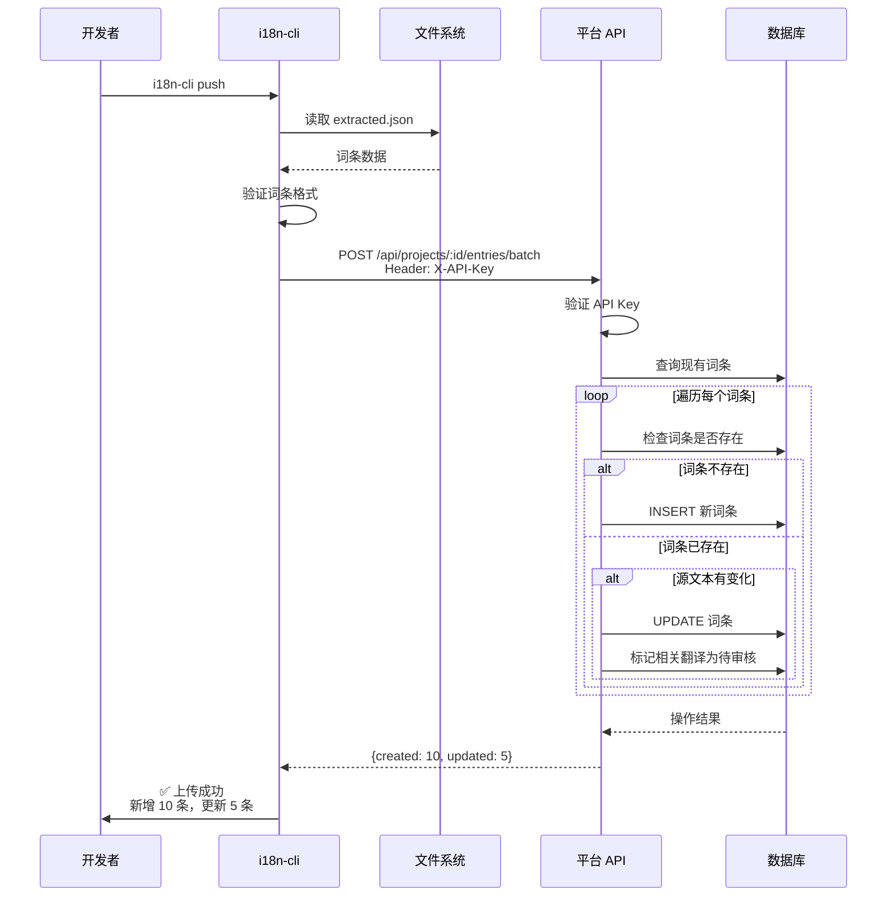

### 2.4 下载翻译流程

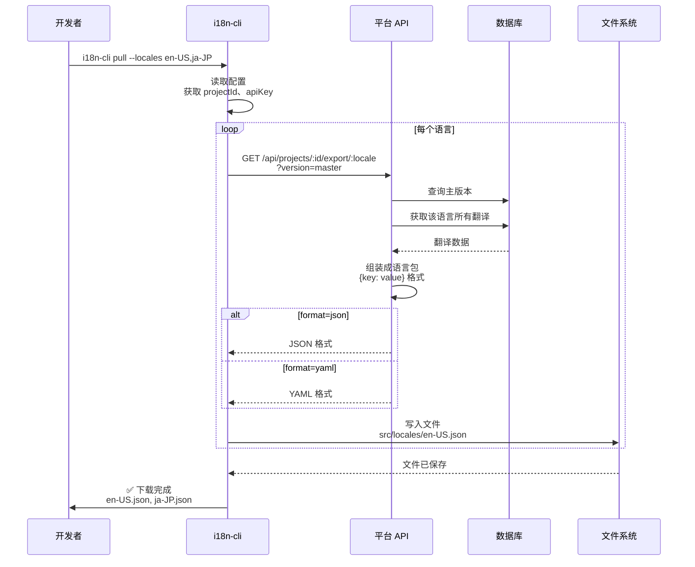

## 3. 平台翻译流程

### 3.1 手动翻译流程

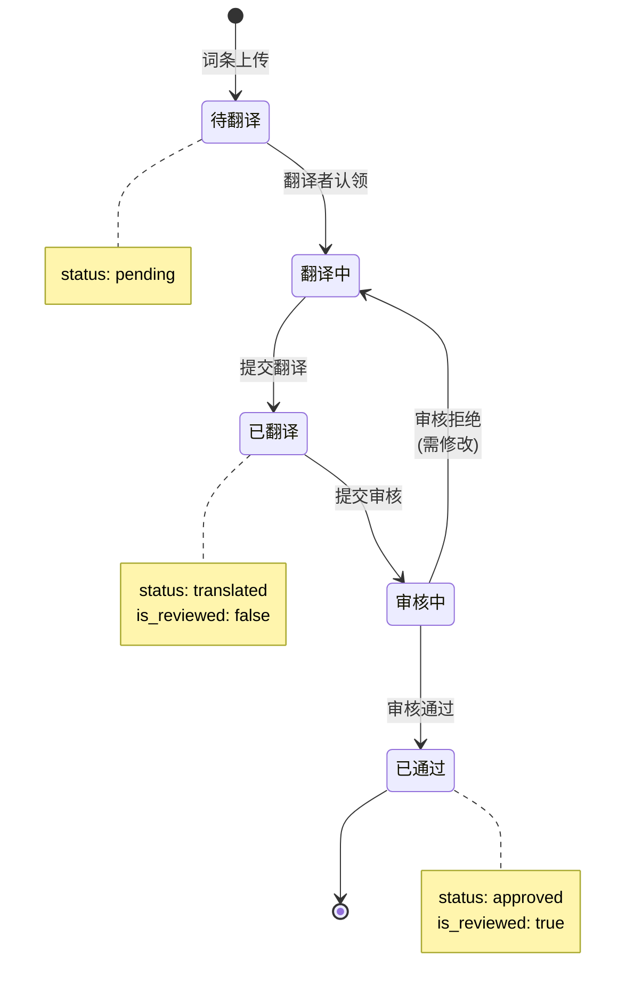

### 3.2 AI 翻译流程

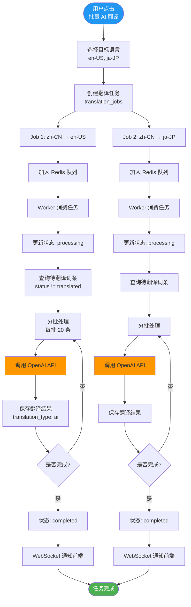

### 3.3 AI 翻译详细序列图

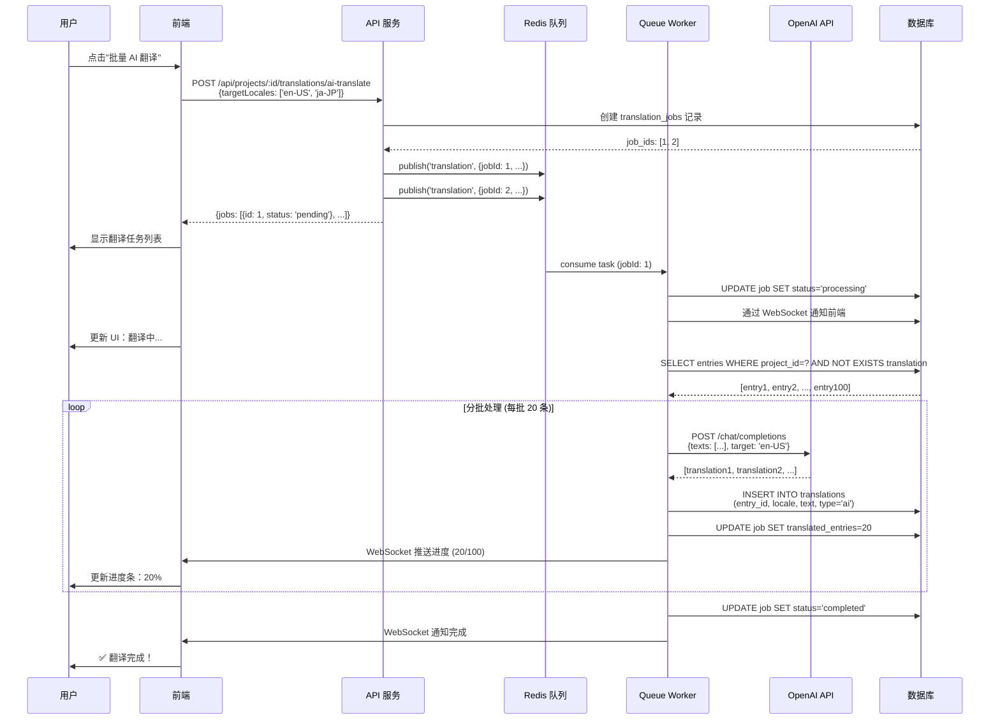

## 4. 版本管理流程

### 4.1 版本创建流程

```mermaid
flowchart TD
    Start([开发者创建版本]) --> CLI[i18n-cli version:create v1.0.0]
    
    CLI --> GetBranch[获取当前 Git 分支]
    GetBranch --> GetCommit[获取最新 commit hash]
    
    GetCommit --> CallAPI[POST /api/projects/:id/versions<br/>{versionName, branchName, commitHash}]
    
    CallAPI --> QueryEntries[查询当前所有词条]
    QueryEntries --> QueryTranslations[查询所有翻译]
    
    QueryTranslations --> CreateSnapshot[创建快照<br/>保存词条和翻译状态]
    
    CreateSnapshot --> InsertVersion[INSERT INTO versions<br/>{..., snapshot: {...}}]
    
    InsertVersion --> CreateAssociations[创建词条版本关联<br/>entry_versions 表]
    
    CreateAssociations --> Response[返回版本信息]
    Response --> CLI
    
    CLI --> Success([✅ 版本创建成功<br/>v1.0.0])
    
    style Start fill:#2196F3,color:#fff
    style Success fill:#4CAF50,color:#fff
```

### 4.2 设置主版本流程

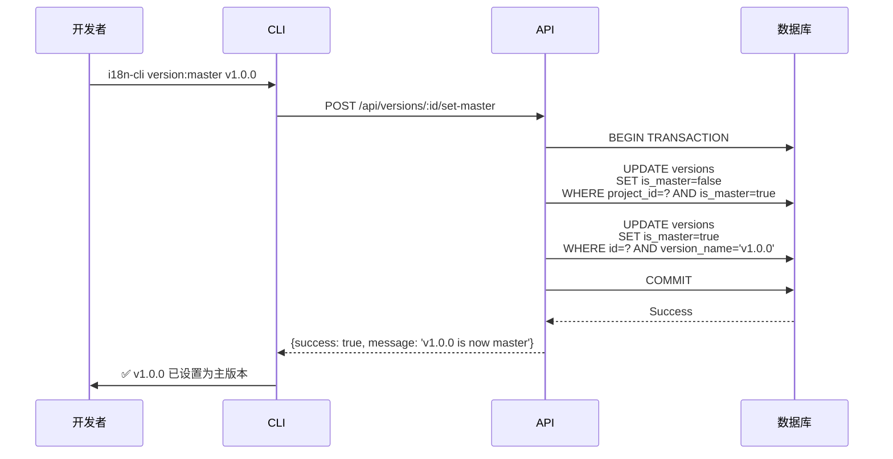

### 4.3 版本对比流程

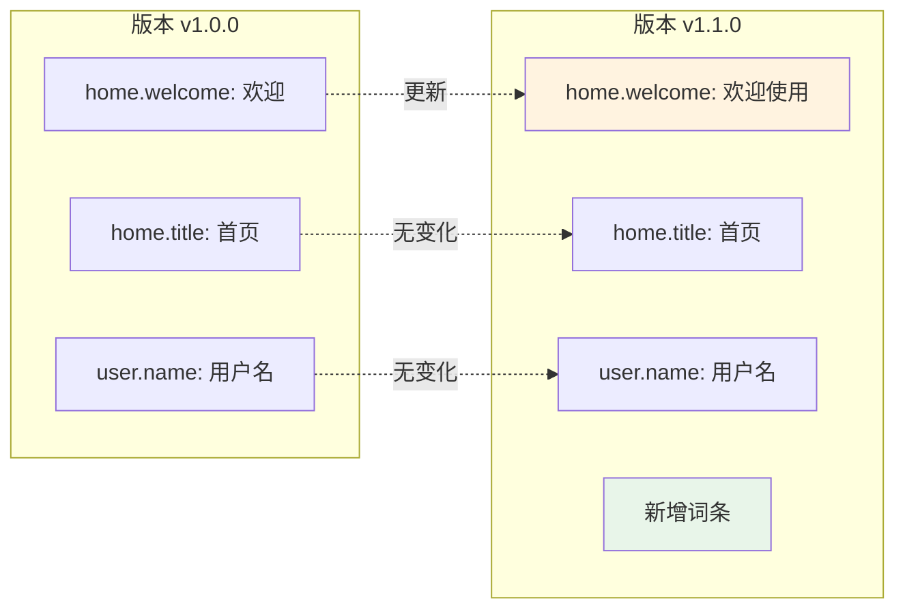

## 5. 数据流转图

### 5.1 词条生命周期

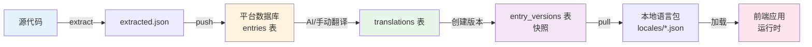

### 5.2 完整的用户旅程

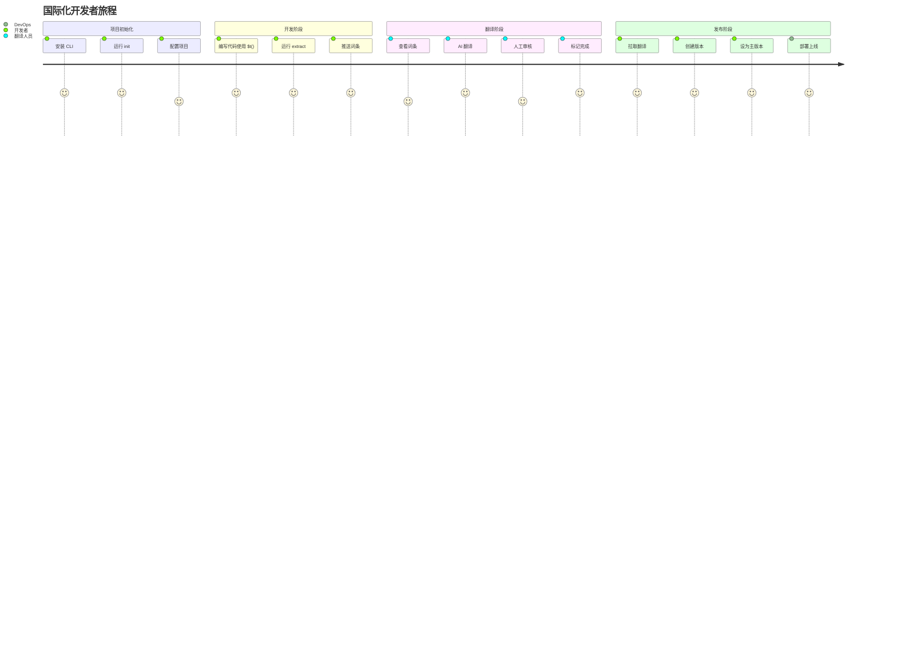

## 6. API 调用流程

### 6.1 认证流程

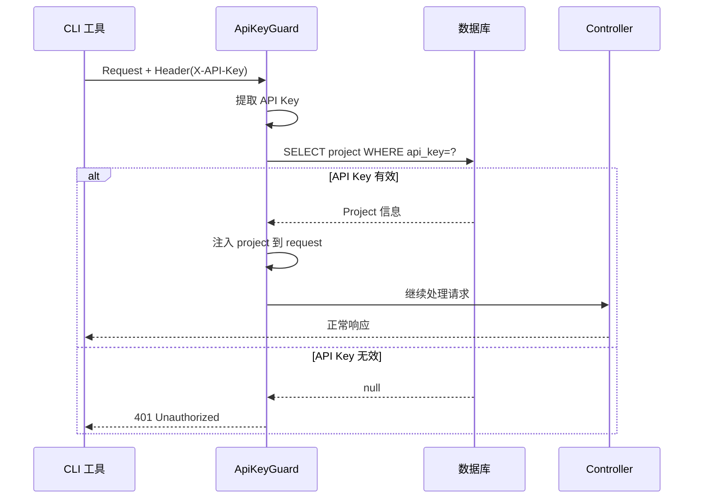

### 6.2 批量导出流程

```mermaid
flowchart TD
    Start([GET /api/projects/:id/export/all]) --> Auth[验证 API Key]
    Auth --> GetVersion[获取版本信息<br/>默认 master]
    
    GetVersion --> QueryData[查询该版本的<br/>所有词条和翻译]
    
    QueryData --> Loop{遍历每个语言}
    
    Loop -->|en-US| BuildEN[构建 en-US.json<br/>{key: translation}]
    Loop -->|ja-JP| BuildJP[构建 ja-JP.json]
    Loop -->|zh-CN| BuildCN[构建 zh-CN.json]
    
    BuildEN --> AddToZip[添加到 ZIP]
    BuildJP --> AddToZip
    BuildCN --> AddToZip
    
    AddToZip --> CreateZip[创建 ZIP 文件<br/>project-v1.0.0.zip]
    
    CreateZip --> Upload[上传到 OSS<br/>可选]
    Upload --> Response[返回下载链接]
    
    Response --> End([客户端下载])
    
    style Start fill:#2196F3,color:#fff
    style End fill:#4CAF50,color:#fff
```

## 7. 错误处理流程

### 7.1 翻译失败处理

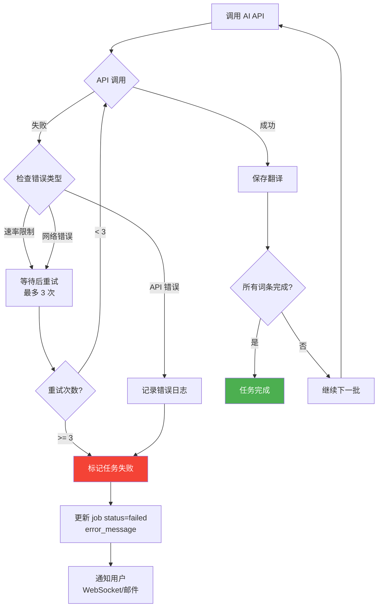

## 8. 缓存策略

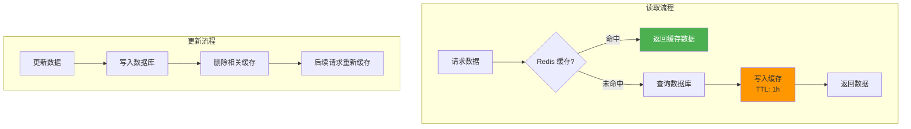

### 缓存键设计

```
# 项目信息
project:{projectId}

# 项目的词条列表
project:{projectId}:entries:page:{page}:status:{status}

# 单个词条详情
entry:{entryId}

# 词条的翻译
entry:{entryId}:translation:{locale}

# 项目的所有翻译（用于导出）
project:{projectId}:export:{locale}:version:{versionName}

# 版本列表
project:{projectId}:versions

# 主版本信息
project:{projectId}:master-version
```

## 9. WebSocket 实时更新

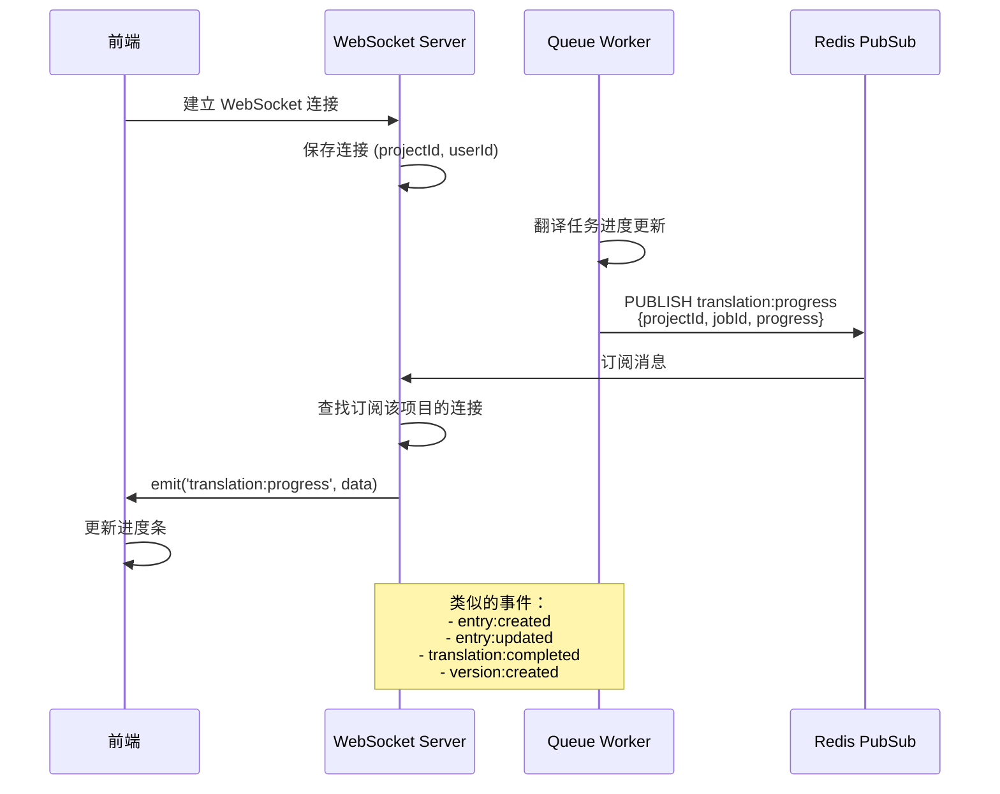

## 10. 部署架构

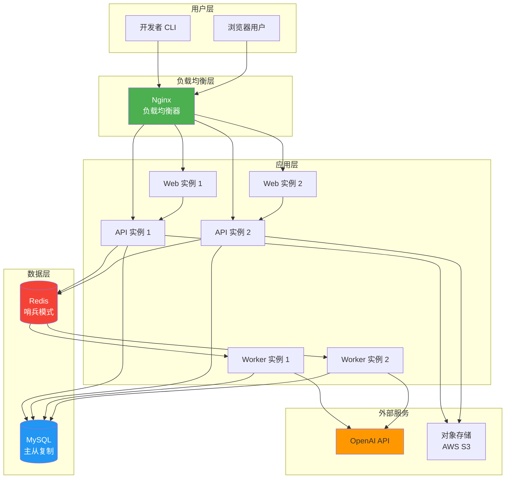

---

以上流程图涵盖了：
1. **系统架构流程** - 整体组件交互
2. **CLI 工作流程** - 开发者使用 CLI 的完整流程
3. **平台翻译流程** - 手动和 AI 翻译的详细步骤
4. **版本管理流程** - 版本创建、设置和对比
5. **数据流转图** - 数据在系统中的流动
6. **API 调用流程** - 认证和导出流程
7. **错误处理流程** - 异常情况的处理
8. **缓存策略** - 提升性能的缓存设计
9. **WebSocket 实时更新** - 实时通知机制
10. **部署架构** - 生产环境部署方案

您可以使用支持 Mermaid 的工具查看这些流程图，如：
- [Mermaid Live Editor](https://mermaid.live)
- VS Code 插件: Markdown Preview Mermaid Support
- Notion、Confluence 等支持 Mermaid 的文档工具
